书名：闇黑論文寫作：一本從碩博生到學者撰寫論文、發表期刊所需的專業手冊～

ISBN：9786263177727

# 开场白与设定

# Part 1 西游记
## 第一章 论文的起源
### 01 本书的起源

何谓西游？到西方寻找现代论文的起源。

> 夫文本同而末异，盖奏议宜雅，书论宜理，铭诔尚实，诗赋欲丽。此四科不同，故能之者偏也；唯通才能备其体。
> 
> ——曹丕《典论·论文》

此“论文”为“品论文章”之意，为文学批评。

学术论文：一种自然科学或是社会科学研究工作者的研究作品，论文指的是在念硕士班、博士班，或是出版在有审查制度期刊上发表的作品。这是一种用来描述科学研究成果的作品。科学文章是一种学术出版物，通常表在科学期刊上，包含原创研究或评论。如果论文是针对一项主题，采取逻辑方式写成的段落文本，并且以学术研究成果方式发表，可以区分为学位论文、学术论文，以及小论文。

### 02 什么是论文？

多种多样的学位论文：

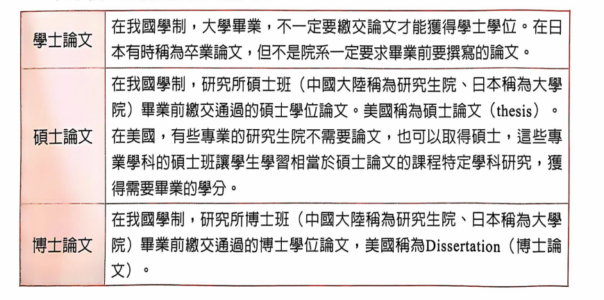

Tips：在英国，thesis与dissertation的用法与美国相反。

中国古代的博士：

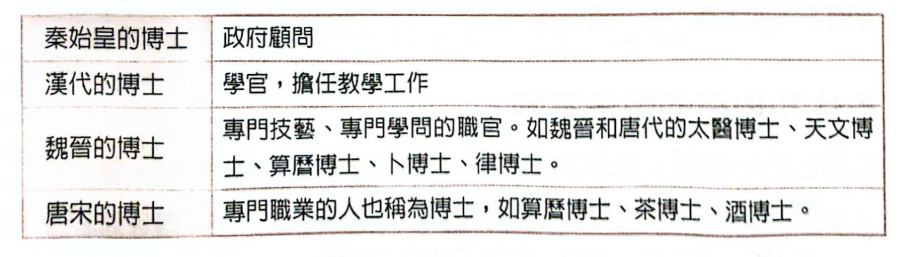

### 03 什么是教授？

古代的教授：

中国古代类似“论文”“博士”，原本也是另外的含义，产生于汉代，为动词。宋太宗后，王宫子弟老师称为教授，首度名词化。元明清后推广至各路、州、府及地方府学。至清代，为正七品文官，即府学学官。

英语的 professor ，源出于十四世纪后期的拉丁文，意思是“教授”某一领域知识的人。这个词也是出现于古法语的professeur，通称艺术或科学专业学科的人，也是一种最高级别的教师的意思。英语的 professor出现的历史，可以追溯到1706年。一般英文professor的简写，可以写成prof。最早的prof的纪录可以追溯到1838年。

### 04 什么是“考试论文”？

考试论文是国家考试为测验考生的国文程度，要求在考场撰写的论文。考试论文古称策论，唐代科举考试中，最常见的科目是“进士”和“明经”。进士科的主要考试内容包括“帖经”“杂文”“策论”，明经科的主要考试内容包括“帖经”和“墨义”。

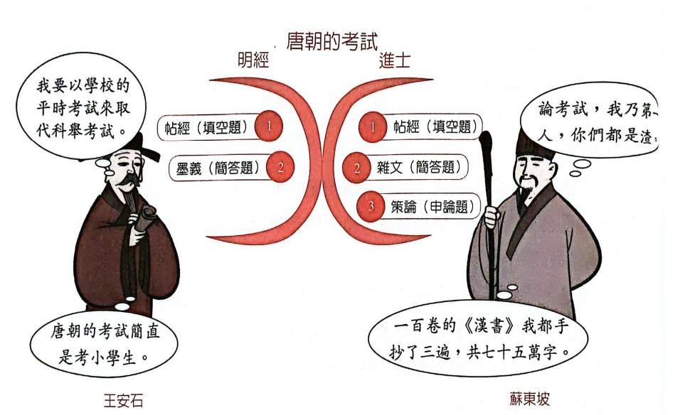

### 05 您考论文，有创意吗？

宋朝王安石执政时，曾对科举制度进行改革，把帖经、墨义和赋等考试都取消了，改以经义(解释经书)、论(对时局的评论)和策(提出解决时弊的办法)，作为考试内容。

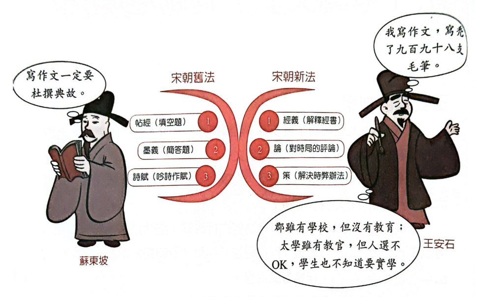

### 06 用“发策”写论文

明清的时代，中国陷入了八股文的时代。明宪宗成化年间(1465~1487)着重技巧，使用八股文挑考生。考官喜工工整整的对仗感觉，鼓励用排偶文体，阐发经义的科举考试。采用排比的文体，信奉重复性很高的句子，只要求句子等长，代表一种中文结构的力量。

| 名称 | 另名                   | 行文格式                                                           | 内容要求                                                                                             |
|------|------------------------|--------------------------------------------------------------------|------------------------------------------------------------------------------------------------------|
| 破题 | 无                     | 二句散行文字。                                                     | 将题目字面意义破释。                                                                                 |
| 承题 | 无                     | 四、五句散行文字。                                                 | 将破题中紧要之意，承接而下，引申而言，使之晓畅。要求明快关连，不可脱节。                             |
| 起讲 | 小讲、原起             | 散行文字                                                           | 浑写题意，笼罩全局。                                                                                 |
| 起股 | 起比、题比、提股、前股 | 四五句或八九句双行文字，两扇句式必须相同，要求相对成文，形成排偶。 | 开始发议论                                                                                           |
| 中股 | 中比                   | 句式双行，句数多少无定制。要求相对成文，形成排偶。                 | 内容是全篇的重心所在，必须尽情发挥，进一步搜剔题中正反神理奥妙，要求锁上关下，轻松灵活，宜虚不宜实。 |
| 后股 | 后比                   | 句式双行，多少无定制。需相对成文，形成排偶。                       | 作用是畅发中比所未尽，或推开，或垫衬，要求庄重踏实，振起全篇精神。                                   |
| 束股 | 束比                   | 双行，每扇二、三句或四、五句。需相对成文，形成排偶。               | 用来回应、提醒全篇而加以收束。                                                                       |
| 大结 | 无                     | 散行，不一定用对偶。                                               | 全文结束语，不用圣贤口气，可以发挥己意。                                                             |

### 07 明朝五种“策问论文”类型

明朝科举考试，分为乡试、会试和殿试。
试题种类从内容上划分，主要可以分为治国总论类、封建伦理类、经济理财类、军事武略类、文化教育类等五种，内容还是很符合时事。

治国总论类的试题，是希望从总体上，探讨治理国家的策略。这类试题包含了"策问"和"论"两种题型。

封建伦理类题型，考核考生对于国家的忠诚度和道德思想。包含封建时代对于仁、义、礼、智、信方面的知识。这类的考题，包含在四书《论语》、《孟子》、《大学》、《中庸》中的"义"、"策问"、"论"三种题型。

军事武略类题型，形式包含有边关管理的"判语"、"策问"，这些军事武略试题，要阅读《五经七书》等战略书籍，并且要求考生对于塞外军事问题，说明自己的观点。

经济理财类从赋税、劝俭等反商主义形式着手，包含了"义"、"策问"、"论"等内容，通常从《盐铁论》等书籍着手，并且要求考生对于粮饷、国家经费欠收的问题，说明自己的观点。

文化教育类的题目，涉及国家统治与人才培养、兴办学校、教育理论。教育著作等批判思考，出题的方向有"义"、"策问"、"诏"、"表"、"判语"等形式。

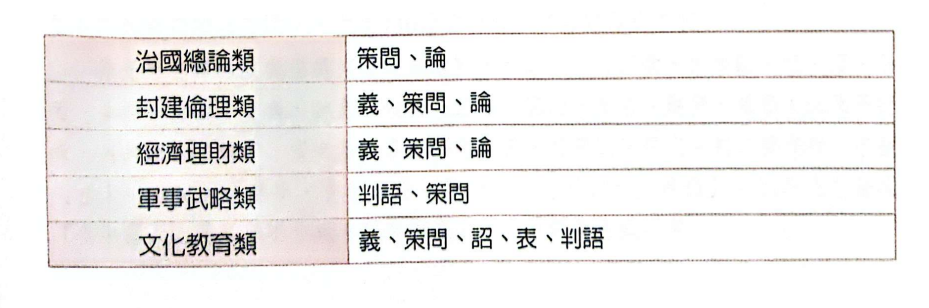

### 08 利玛窦的科学教义

为中国带来了现代科学。

### 09 从清末到民国初年的考试

到了二十世纪，1901年清末湖广总督张之洞（1837~1909）请光绪皇帝降旨改革科举，张之洞提倡兴办西学学校、改变科举、变更科学，仿照日本学制设立学堂。

清廷下诏自1902年开始改革文科，第一场考试考中国政治史事论五篇，第二场考试考各国政治艺学策五道，第三场考试考四书《论语》、《孟子》、《大学》、《中庸》"义"两篇，以及五经《诗经》、《尚书》、《礼记》、《周易》和《春秋》"义"一篇，且不准用八股文。

1904年清廷颁布《奏定学堂章程》，称为癸卯学制，称为中国第一个法定新式教育学制。1906年科举制度废止，在全国推广新式学堂。

到了民国，1912年孙文（1866~1925）在南京就任临时大总统后，法制局编签文官试验章程，文官考试分为高等文官考试、普通文官考试二类。

高等文官考试分预试、正式两种，非预试合格者，不得应正式试。预试分为二场，第一场为论文考试，第二场为口述考试，论文考试及口述考试，均应以法制、经济命题。

国内外高等专门以上各学校毕业者，不用预试。

考试科目为：（一）宪法；（二）刑律；（三）民律；（四）行政法；（五）国际公法；（六）经济学；以上六种为必试科目。（七）财政学；（八）商律；（九）刑事诉讼律；（十）民事诉讼律；（十一）国际私法；以上为选择科目。

### 10 从东方到西方的科技

早期的中国留学生

## 第二章 翻滚吧！论文

### 01 从西方到东方的学位

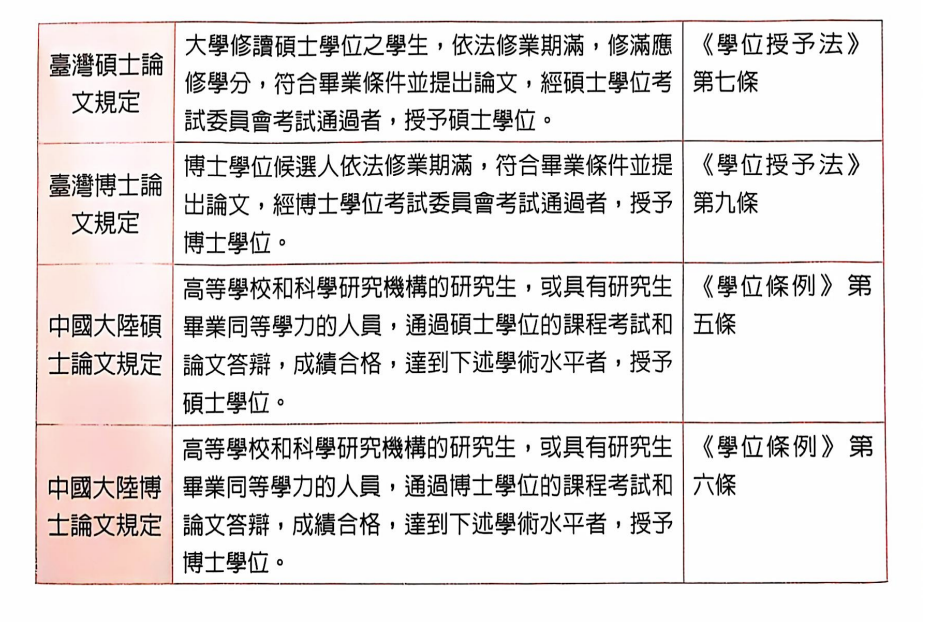

### 02 了解您的名词：博士

哲学博士（doctor of philosophy）

原本的哲学意义不同。doctor的词源为拉丁语docere，并无广博的意思，而为指导之意。

### 03 了解您的名词：博士不止一种

最早的博士点在巴黎。最早的哲学博士在柏林。
在美国，与哲学博士相对的是专业博士。

### 04 了解您的形容词：大学

失意的洪堡与最早的兼具教学与研究功能的现代大学。

### 05 什么是学位论文

university的词源来自行会

19世纪中随着学位制度的稳定，学位论文的标准大致确定。

学位论文是要在毕业之前完成，需要提交的论文。
特别是硕士论文和博士论文，需要在提交之后进行发表（presentation）、公开询答(public query)，或是进行口试(defense)
论文口试，通常在研究生口头陈述之后，由论文查委员会委员（committee members）进行通过/失败判断。有的国家在博士论文审查中，通常需要在提交后进行口试(答辩)和语言测试，并且与论文一同由审查委员会判定通过/不通过。并且核定签名。

学位论文通常遵循以下章节：

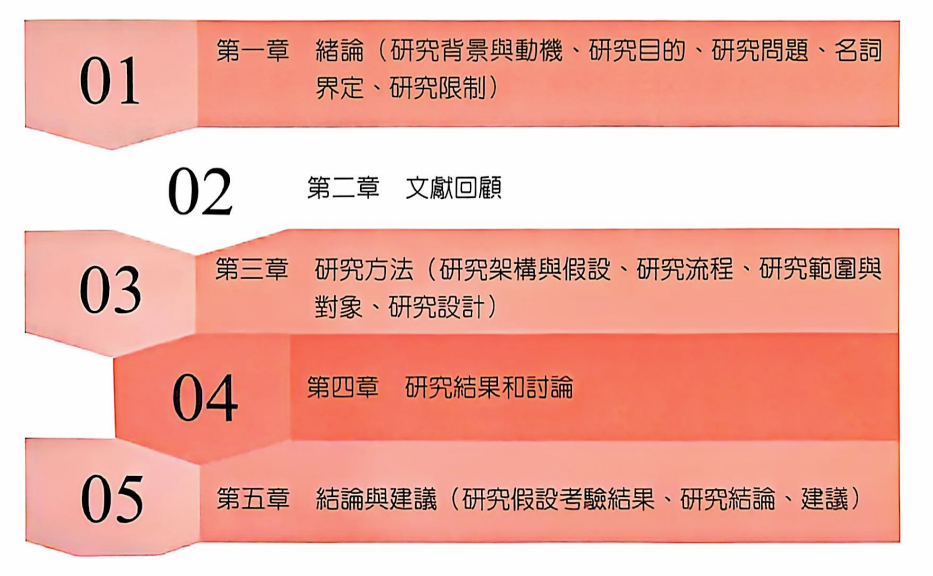

### 06 准备学位论文

学位论文一定是可靠的科学论文。

第一步是起草论文陈述（drafting a thesis statement），寻找问题

这是一个批判性分析。
需要回答一个科学问题或假设。希望您从各种来源，收集证据以便您做出解释和判断。
您的方法，应该过精心设计。
您的结果应该在您的主题背景下，进行明确定义和讨论。
您应该要引用相关文献。
我们正在寻找合理的论点，从您最初的问题，相关证据，进行澄清。
是否您在科学的背景之下，收集必要的资讯。请根您的分析，进行判断。

论文陈述需要回答几个问题：您的论文是关于什么的问题?是否能够在论文陈述中，清楚地阐明您的论点?您的读者，是否能够快速识别您要证明的内容?

### 07 准备学写议论文

论文通常是议论文。议论文依靠事实和逻辑证明论点。与说明文不同，议论文要说服读者接受文章所支持的观点。因此，需要讨论不同的论点。

简单的议论文采用五段格式：

第一段是您的介绍，清楚地展示了您的论文，设置了文章的其余部分，甚至可能增强了文字吸引力。

第二段到第四段，是您的正文。可以在其中提出您的论点和证据，并驳斥反对者的论点。此外，每个段落都应该侧重于表示支持证据，或是反驳矛盾的观点。

第五段也是最后一段，是最后的结论。需要将所有先前证据的背景，重新进行审视，并且简洁地进行总结。

### 08/09/10 图尔敏式论证/图尔敏式折衷主义

亚里士多德经典论证：

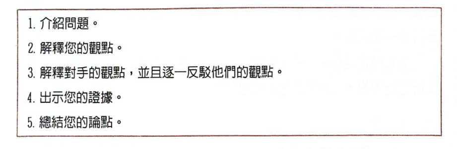

谁是图尔敏。

图尔敏反对绝对主义，认为不存在柏拉图式的普遍真理，论证随领域变化称为领域依赖，反之称为领域不变。

图尔敏批评现代哲学忽视实际问题而偏爱抽象问题。提出向人文主义的四个回归：回归口头交流和口语。回归处理日常生活中的实际道德问题。回归具体文化历史背景。回归及时，即从永恒问题回归理性主义取决于我们解决方案的时间线上的事物。

实践论证更关注论证的证成，而非其推理功能。更多是测试和筛选现有想法而不是发现新想法。

提出了六个论证要素

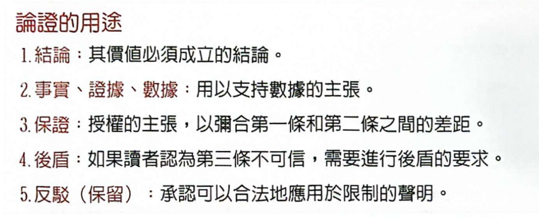

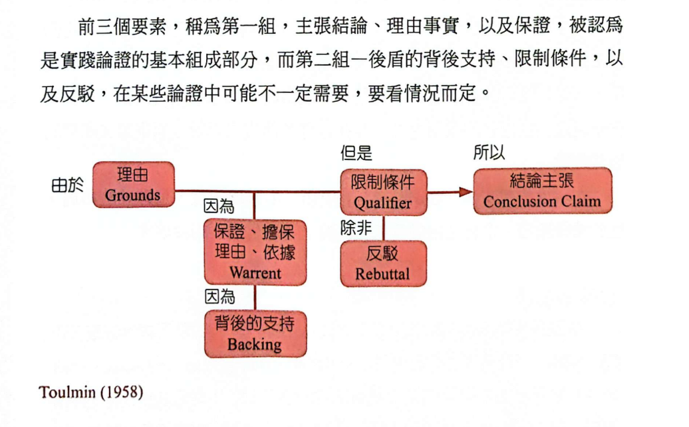

图尔敏支持维特根斯坦对无法言说之事保持沉默的态度，反对二元对立与对确定性的追求。

图尔敏论证模型的批评：以事实开始，以结论结束，忽略了论证的潜在问题。

图尔敏模型是一种二元对立论述。

采用图尔敏模型的论文结构

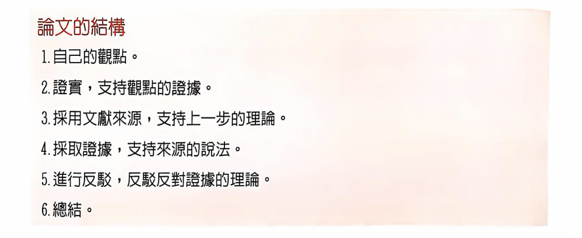

图尔敏式二元划分

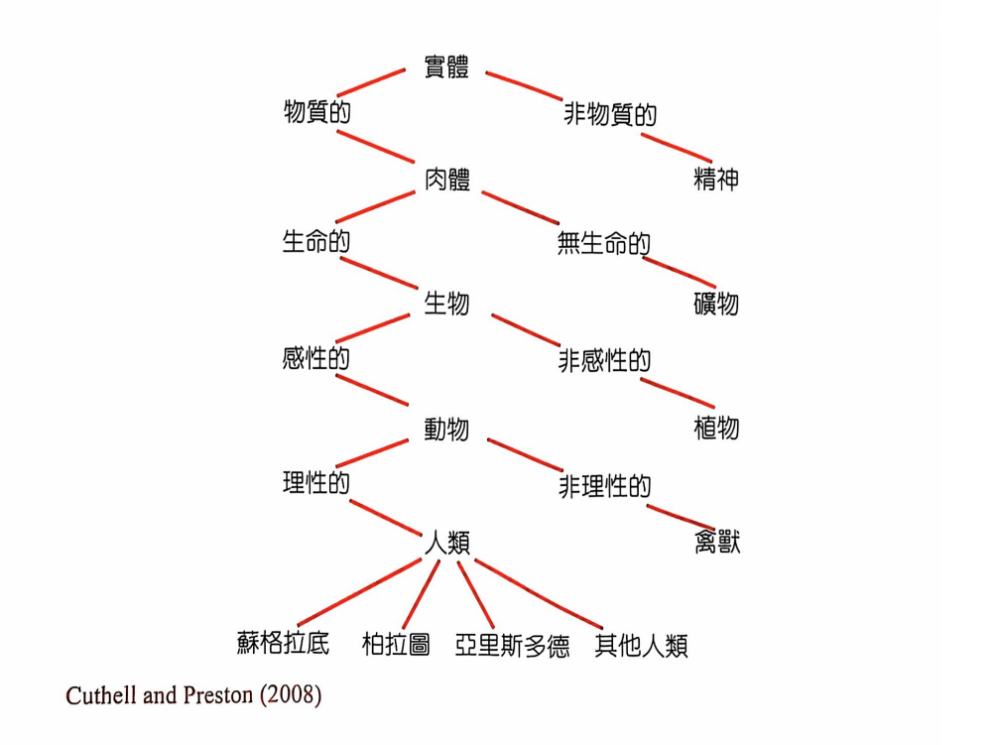

# 11 论文开始前入门整理

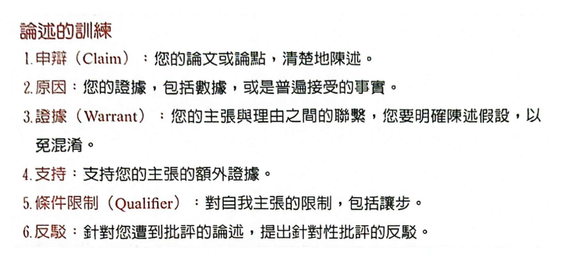